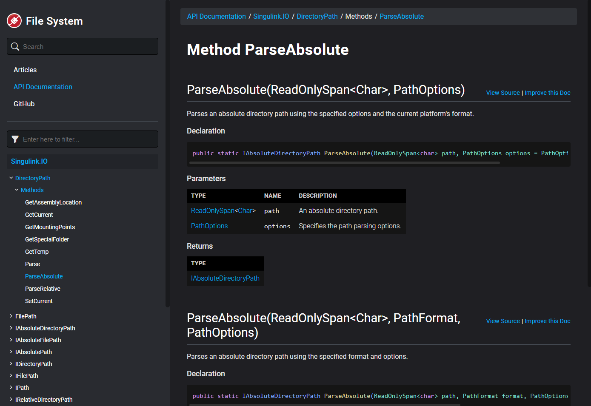
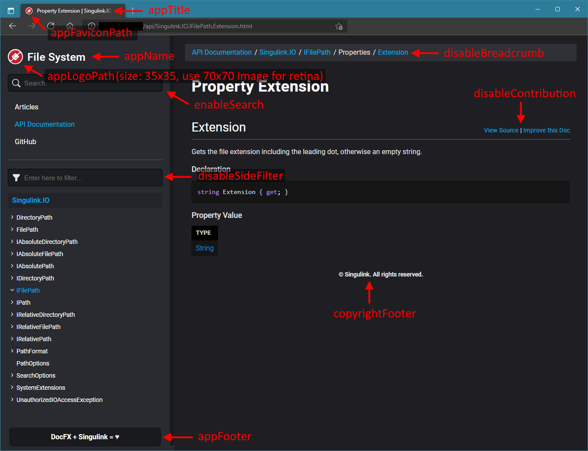
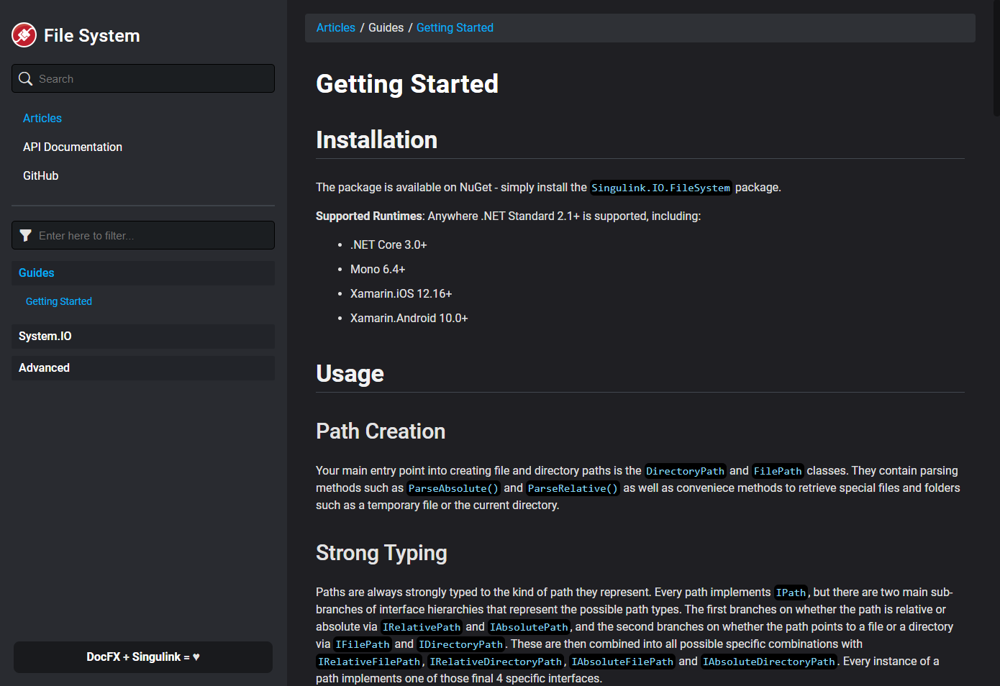
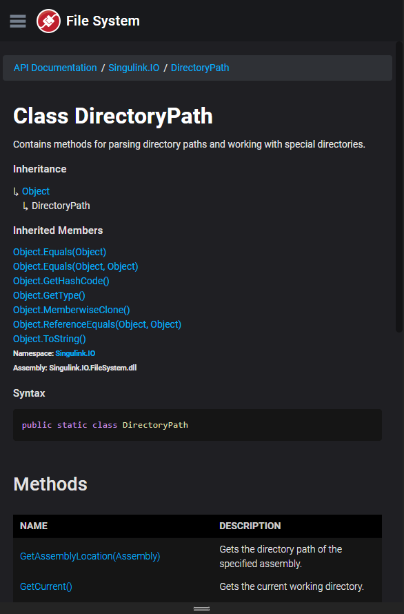
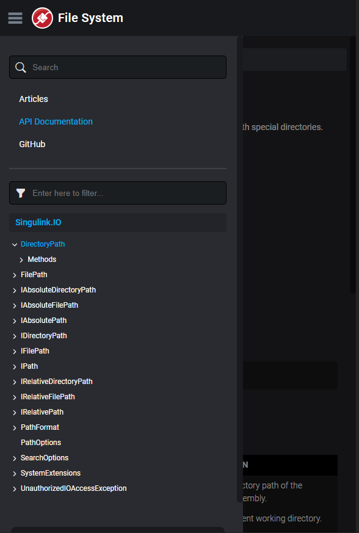

# SingulinkFX

[](https://gitter.im/Singulink/community?utm_source=badge&utm_medium=badge&utm_campaign=pr-badge&utm_content=badge)

**SingulinkFX** is a [DocFX](https://dotnet.github.io/docfx/) template used by Singulink projects. It is fully responsive and works beautifully together with the `memberpage` plugin to produce documentation that is familiar to those used to browsing Microsoft .NET documentation.

**Features:**
- Responsive layout that works well with all devices.
- Easily configurable side bar width.
- Empty table columns are removed, so if you don't comment the parameters or return value on some methods then it won't display an empty description column.
- The table of contents supports 4 levels of items to properly facilitate usage together with `memberpage`.
- Contains optional style overrides that are optimized for articles, mostly changing how heading tags (`h1` to `h5`) are displayed. Just wrap your HTML or markdown article with `<div class="article"></div>` for a much nicer article layout that works nicely with up to 5 heading levels.

### About Singulink

We are a small team of engineers and designers dedicated to building beautiful, functional and well-engineered software solutions. We offer very competitive rates as well as fixed-price contracts and welcome inquiries to discuss any custom development / project support needs you may have.

Visit https://github.com/Singulink to see our full list of publicly available libraries and other open-source projects.

### [Live Demo (Singulink.IO.FileSystem)](https://www.singulink.com/Docs/Singulink.IO.FileSystem/)



## Installation 

1. Download the source or the zipped file from the [releases page](https://github.com/jbltx/DiscordFX/releases).
2. In your DocFX project folder, create a new directory named `templates`, if it doesn't already exist.
3. Copy the `singulinkfx` folder from this repository into your `templates` folder.
4. [Download the memberpage plugin](https://dotnet.github.io/docfx/templates-and-plugins/plugins-dashboard.html) and follow instructions, place it into a `plugins` folder
5. In your `docfx.json` configuration file, add `singulinkfx` and `memberpage` path into the `build.template` property:
   ```json
   "template": ["default", "templates/discordfx-plus", "plugins/memberpage.2.59.0/content"]
   ```

## Customization

### Configuration

The following is a sample `docfx.json` global metadata section that demonstrates the usage of the options this theme offers:
```json
"globalMetadata": {
    "_appTitle": "Singulink.IO.FileSystem",
    "_appName": "File System",
    "_appFaviconPath": "images/favicon.png",
    "_appLogoPath": "images/logo.png",
    "_appFooter": "<strong>DocFX + Singulink = ♥</strong>",
    "_copyrightFooter": "© Singulink. All rights reserved.",
    "_enableSearch": true,
    "_disableSideFilter": false,
    "_enableNewTab": true,
    "_disableContribution": false,
    "_disableBreadcrumb": false,
}
```


### Colors and Layout

You can change any color as well as the width of the side bar and font sizes for desktop and mobile views. The values are defined in the `styles/config.css` file. The recommended approach to changing the default values is to create another directory inside `templates` for your sub-theme that overrides these values in a `styles/main.css` file, and add your theme to the end of the list of templates in `docfx.json`. Your `main.css` file will be automatically referenced in the output, there is no need to override any other template files.

### Custom Javascript

The `styles/main.js` file can be used to add your own custom Javascript. The recommended approach is to create another directory inside `templates` for your sub-theme, add a `styles/main.js` file, and add your theme to the end of the list of templates in `docfx.json`. Your `main.js` file will be automatically referenced in the output, there is no need to override any other template files.

## More Screenshots






